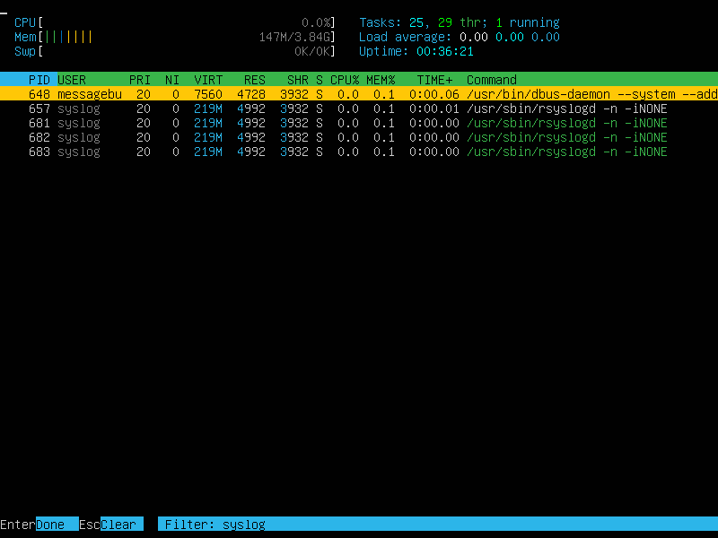
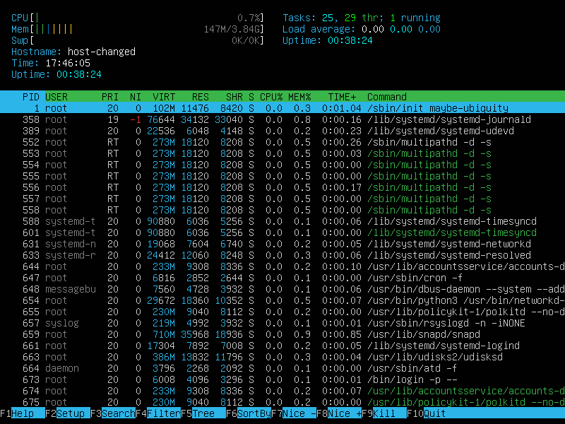

## Part 1. Установка ОС
* Вывод версии Ubuntu с помощью команды `cat /etc/issue`

## Part 2. Создание пользователя
* Команда для создания нового пользователя.

- Вывод команды `cat /etc/passwd`

## Part 3. Настройка сети ОС
1. **Задание названия машины вида user-1, команда:** `sudo hostnamectl set-hostname user-1`

2. **Установка временной зоны, соответствующей моему текущему местоположению, команда:** `sudo timedatectl set-timezone Europe/Moscow`
* Результат установки временной зоны

3. **Вывести названия сетевых интерфейсов с помощью консольной команды.**
* Вывод названий сетевых интерфейсов, команда: `ip a`

* Io (loopback interface) - это аппаратный или программный , который направляет полученный сигнал или данные обратно отправителю. Он используется как дополнительное средство в исправлении проблем физического соединения.

4. **Используя консольную команду получить ip адрес устройства, на котором вы работаете, от DHCP сервера. Дать расшифровку DHCP.**
* Получение ip адреса устройства, на котором работаю, команда: `hostname -I`

* DCHP (Dynamic Host Configuration Protocol) — протокол динамической настройки узла) — прикладной протокол, позволяющий сетевым устройствам автоматически получать IP-адрес и другие параметры, необходимые для работы в сети TCP/IP. Данный протокол работает по модели «клиент-сервер». Для автоматической конфигурации компьютер-клиент на этапе конфигурации сетевого устройства обращается к так называемому серверу DHCP и получает от него нужные параметры. Сетевой администратор может задать диапазон адресов, распределяемых сервером среди компьютеров. Это позволяет избежать ручной настройки компьютеров сети и уменьшает количество ошибок. Протокол DHCP используется в большинстве сетей TCP/IP.

5. **Определить и вывести на экран внешний ip-адрес шлюза (ip) и внутренний IP-адрес шлюза, он же ip-адрес по умолчанию (gw).**
* Получение внешнего ip адреса шлюза, команда: `curl icanhazip.com` или `curl ifconfig.me`
* Получение внутреннего ip адреса шлюза, команда: `ip route`
* Результаты вывода команд

6. **Задать статичные (заданные вручную, а не полученные от DHCP сервера) настройки ip, gw, dns (использовать публичный DNS серверы, например 1.1.1.1 или 8.8.8.8).**
* Ввёл команду `sudo vim /etc/netplan/00-installer-config.yaml` и внёс изменения.

* Применил изменения командой `sudo netplan apply`

7. **Перезагрузить виртуальную машину. Убедиться, что статичные сетевые настройки (ip, gw, dns) соответствуют заданным в предыдущем пункте.**
* Перезагрузил машину командой `sudo reboot` и проверил ip машины командой `ip route`

Успешно пропинговал командой `ping 1.1.1.1` и `ping ya.ru`.

##   Part 4. Обновление ОС
**Обновить системные пакеты до последней на момент выполнения задания версии.**

* Обновление индекса пакетов системы, команда: `sudo apt-get update`
* Обновление всех устаревших пакетов до последних версий, команда: `sudo apt-get upgrade`

* Cообщение об отсутствующих обновлениях

## Part 5. Использование команды sudo
**Разрешить пользователю, созданному в Part 2, выполнять команду sudo.**
* Добавил пользователя guest в группу sudo, команда: `sudo usermod -aG sudo guest`

* Команда sudo предоставляет возможность пользователям выполнять команды от имени суперпользователя root, либо других пользователей. Правила, используемые sudo для принятия решения о предоставлении доступа, находятся в файле /etc/sudoers (для редактирования файла можно использовать специальный редактор visudo, запускаемый из командной строки без параметров, в том числе без указания пути к файлу); язык их написания и примеры использования подробно изложены в man sudoers).Имя команды означает substitute user do или super user do. Утилита позволяет запускать программы от имени другого пользователя, но чаще всего от имени корневого. Утилита была разработана еще в 1980 году Бобом Когшелом и Клиффом Спенсером. За это время сменилось много разработчиков и было добавлено много функций.
* Имя машины изменено

##   Part 6. Установка и настройка службы времени
1. **Настроить службу автоматической синхронизации времени.**
* Для начала установил утилиту ntp командой `sudo apt install ntp`
* Проверил, что подключен к серверам синхронизации времени командой `ntpq -p`
* Затем остановил ntp командой `sudo systemctl stop ntp`
* Затем принудительно синхронизировал время командой `sudo ntpd -gq`
* Запустил ntp командой `sudo systemctl start ntp`
* Вывод команды `timedatectl show` содержит `NTPSynchronized=yes`

## Part 7. Установка и использование текстовых редакторов
* Для установки MCEDIT использовал команду `sudo apt install mc`

1. **Используя каждый из трех выбранных редакторов, создайте файл test_X.txt, где X -- название редактора, в котором создан файл. Напишите в нём свой никнейм, закройте файл с сохранением изменений.**

* Содержимое файла test_VIM.txt перед закрытием

Для выхода с сохранением изменений ввёл `:wq` затем нажал `Enter`

* Содержимое файла test_NANO.txt перед закрытием

Для выхода с сохранением изменений нажал `Ctrl` + `X` затем `Y` и далее `Enter`

* Содержимое файла test_MCEDIT.txt перед закрытием

Для выхода с сохранением изменений нажал `Esc` и далее в окне подтверждения выбрал `Yes` нажатием `ENTER`

2. **Используя каждый из трех выбранных редакторов, откройте файл на редактирование, отредактируйте файл, заменив никнейм на строку "21 School 21", закройте файл без сохранения изменений.**

* Содержимое файла test_VIM.txt после редактирования

Для выхода без сохранения изменений ввёл `:q

` затем нажал `Enter`

* Содержимое файла test_NANO.txt после редактирования

Для выхода с сохранением изменений нажал `Ctrl` + `X` затем `N`

* Содержимое файла test_MCEDIT.txt после редактирования

Для выхода с сохранением изменений нажал `Esc` и далее в окне подтверждения выбрал `No` нажатием `ENTER`

3. **Используя каждый из трех выбранных редакторов, отредактируйте файл ещё раз (по аналогии с предыдущим пунктом), а затем освойте функции поиска по содержимому файла (слово) и замены слова на любое другое.**

* Скриншот из VIM с результатами поиска

Для поиска в VIM нажал `/` и ввёл искомую строку. Совпадение автоматически выделяется.

* Скриншот из NANO с результатами поиска

Для поиска в NANO нажал `Ctrl` + `W`, затем ввёл искомую строку и нажал `Enter`. Курсор переместился к началу совпадения в тексте. Снизу появилась информация о количестве совпадений.

* Скриншот из MCEDIT с результатами поиска

Для поиска в MCEDIT нажал `F7`, затем ввёл искомую строку и выбрал `Ok` в окне с параметрами поиска.

* Скриншот из VIM с командой, введённой для замены слова на другое

Для замены ввёл `:s/chaurodr/21 School 21`

* Скриншот из NANO с командой, введённой для замены слова на другое

Нажал `Ctrl` + `\ ` и ввёл искомую строку

Затем ввёл замену и нажал `Enter`

И на этапе подтверждения нажал `Y`

* Скриншот из MCEDIT с командой, введённой для замены слова на другое

Нажал `F4` ввёл искомую строку, ввёл замену и выбрал "ok".

В появившемся окне выбрал "Replace".

## Part 8. Установка и базовая настройка сервиса SSHD
1. **Установить службу SSHd.**
Установить SSH-сервер в системе, команда: `sudo apt install openssh-server`

2. **Добавить автостарт службы при загрузке системы.**
Для включения автостарта службы воспользуемся командой: `sudo systemctl enable ssh`

3. **Перенастроить службу SSHd на порт 2022.**
* Для этого открыл файл конфигурации с помощью команды: `vim /etc/ssh/sshd_config`
* Нашёл строку, определяющую порт: Port 22
* Поменял его на 2022 и раскомментировал строку.

* Затем перезапустил службу с помощью команды `sudo systemctl restart sshd`

4. **Используя команду ps, показать наличие процесса sshd. Для этого к команде нужно подобрать ключи.**
* Для этого использовал команду `ps -aux | grep ssh`
Результат вывода

* Утилита `ps` (от англ. Process State — «состояние процессов») — это встроенная программа для Unix-подобных операционных систем. Прежде всего, она широко используется при администрировании ОС семейства GNU / Linux. С ее помощью осуществляется мониторинг активных процессов по виртуальным файлам в файловой системе `/proc`.

**Ключи команды `ps`:**
* `-A`, `-e` - выбрать все процессы
* `-a` - выбрать все процессы, кроме фоновых
* `-d` - выбрать все процессы, даже фоновые, кроме процессов сессий
* `-N` - выбрать все процессы кроме указанных
* `-С` - выбирать процессы по имени команды
* `-G` - выбрать процессы по ID группы
* `-p` - выбрать процессы PID
* `--ppid` - выбрать процессы по PID родительского процесса
* `-s` - выбрать процессы по ID сессии
* `-t` - выбрать процессы по tty
* `-u` - выбрать процессы пользователя
* `-x` - найти все вхождения строки поиска

**Опции форматирования:**
* `-с` - отображать информацию планировщика
* `-f` - вывести максимум доступных данных, например, количество потоков
* `-F` - аналогично `-f`, только выводит ещё больше данных
* `-l` - длинный формат вывода
* `-j` - вывести процессы в стиле Jobs, минимум информации
* `-M` - добавить информацию о безопасности
* `-o` - позволяет определить свой формат вывода
* `--sort` - выполнять сортировку по указанной колонке
* `-L` - отображать потоки процессов в колонках LWP и NLWP
* `-m` - вывести потоки после процесса
* `-V` - вывести информацию о версии
* `-H` - отображать дерево процессов.
    5. Перезапустить систему.
* Перезапустил систему с помощью команды `sudo reboot`
* Скачал утилиту netstat с помощью команды `sudo apt install net-tools`
* Вывод команды `netstat -tan`

Вывод соответствует требуему заданием.

**Объяснение значения ключей -tan, значения каждого столбца вывода, значения 0.0.0.0:**
* `-t` - Отображение текущего подключения в состоянии переноса нагрузки с процессора на сетевой адаптер при передаче данных.
* `-a` - Отображение всех подключений и ожидающих портов.
* `-n` - Отображение адресов и номеров портов в числовом формате.
* Proto - протокол (tcp, udp, raw), используемый сокетом. TCP/IP — сетевая модель передачи данных, представленных в цифровом виде. Модель описывает способ передачи данных от источника информации к получателю.
* Recv-Q - счётчик байт не скопированных программой пользователя из этого сокета.
* Send-Q - счётчик байт, не подтверждённых удалённым узлом.
* Local Address - адрес и номер порта локального конца сокета.
* Foreign Address - адрес и номер порта удалённого конца сокета.
* State - Состояние сокета. LISTEN - Сокет ожидает входящих подключений. ESTABLISHED - Сокет находится в состянии установленного подключения.
* Адрес 0.0.0.0 означает «любой IP данного компьютера» и включает в себя в том числе 127.0.0.1. Адрес 0.0.0.0 обычно означает, что IP адрес ещё не настроен или не присвоен. Такой адрес указывает хост, который обращается к DHCP для получения IP адреса.

## Part 9. Установка и использование утилит top, htop
**Установить и запустить утилиты top и htop.**
* Запуск утилиты top, команда: `top`
* Вывод команды

* uptime - 1 час 9 минут

* количество авторизованных пользователей - 2

* общая загрузка системы - 0.00. Представлена в виде средних значений за 1, 5 и 15 минут.

* общее количество процессов - 125

* загрузка cpu - 0.5%, среди которых 0.1% отведён под пользовательские процессы (us), 0.2% под процессы ядра(sy), 0.1% под ожидание завершения ввода\вывода (wa), 0.1% под обработку программных прерываний (si).

* загрузка памяти - использовано 180.9 МБ ОЗУ и 476.2 МБ используется под кэш, где хранятся часто используемые области диска.

* pid процесса занимающего больше всего памяти - 714

* pid процесса, занимающего больше всего процессорного времени - 1665

* Запуск утилиты htop, команда: `htop`
* Вывод, отсортированный по PID

* Вывод, отсортированный по PERCENT_CPU

* Вывод, отсортированный по PERCENT_MEM

* Вывод, отсортированный по TIME

* Вывод, отфильтрованный для процесса sshd

* Вывод с процессом syslog, найденным, используя поиск

* Вывод с добавленным выводом hostname, clock и uptime

## Part 10. Использование утилиты fdisk
* Использовал команду `sudo fdisk -l`

* Название жёсткого диска: sda Размер жёсткого диска: 25 ГБ. Количество секторов: 52428800 sectors. При создании виртуальной машины swap не создавался.

## Part 11. Использование утилиты df
1. **Запустить команду df.**
* Запуск утилиты df, команда: `sudo df`

* Размер корневого раздела: 11758760
* Размер занятого пространства: 4830596
* Размер свободного пространства: 6309056
* Процент использования: 44%
* Единица измерения - килобайты.
2. **Запустить команду df -Th.**
* Ввёл команду `sudo df -Th`

* Размер раздела: 12 ГБ
* Размер занятого пространства: 4.7 ГБ
* Размер свободного пространства: 6.1 ГБ
* Процент использования: 44%
* Тип файловой системы для раздела - ext4. Представлен в столбце "Type".

## Part 12. Использование утилиты du
1. **Запустить команду du.**

2. **Вывести размер папок /home, /var, /var/log (в байтах, в человекочитаемом виде)**
* Вывод размера папок /home и /var: `sudo du -h -d 0 /home /var`
* Вывод размера папки /var/log: `sudo du -h -d 0 /var/log`

3. **Вывести размер всего содержимого в /var/log (не общее, а каждого вложенного элемента, используя \*)**
* Вывод размера всего содержимого папки /var/log: `sudo du -h -d 0 /var/log/*`

## Part 13. Установка и использование утилиты ncdu
1. **Установить утилиту ncdu.**
* Команда для установки: `sudo apt-get install nсdu`
2. **Вывести размер папок /home, /var, /var/log.**
* Вывод размера папки /home: `sudo ncdu /home`

* Вывод размера папки /var: `sudo ncdu /var`

* Вывод размера папки /var/log: `sudo ncdu /var/log`

## Part 14. Работа с системными журналами
* Открыть для просмотра: /var/log/dmesg, команда: `less /var/log/dmesg`

* Открыть для просмотра: /var/log/syslog, команда: `less /var/log/syslog`

* Открыть для просмотра: /var/log/auth.log, команда: `less /var/log/auth.log`

* Поиск времени последней успешной авторизации, имени пользователя и метода входа в систему, команда: `sudo grep -ai LOGIN /var/log/auth.log`

* Время последней успешной авторизации: 19:11:46, имя пользователя: chaurodr, метод входа: LOGIN.

* Перезапустить службу SSHd, команда: `sudo systemctl restart sshd`

* Найдём информацию о рестарте sshd службы в системном журнале "auth.log", команда: `sudo grep -a restart /var/log/auth.log`
    

## Part 15. Использование планировщика заданий CRON
1. **Используя планировщик заданий, запустите команду uptime через каждые 2 минуты.**
* Для создания задачи открыл файл планировщика заданий командой `crontab -e`, где `-е` - выбор текстового редактора по умолчанию.
* Вписал следующую строку для задачи.

* Проверяем выполнение заданий планировщиком по записял в лог файле командой: `sudo grep CRON /var/log/syslog`

* Удаляем все задания из планировщика заданий командой: `cronetab -e` и редактированием файла.

