a## Part 1. Инструмент ipcalc

### 1.1. Сети и маски

1) **Адрес сети 192.167.38.54/13:**

Адрес сети: `192.160.0.0/13`

2) **Перевод маски 255.255.255.0 в префиксную и двоичную запись, /15 в обычную и двоичную, 11111111.11111111.11111111.11110000 в обычную и префиксную**

**Маска** - `255.255.255.0`
```
В префиксном виде: /24
В двоичном виде:   11111111.11111111.11111111.00000000
```

**Маска** - `/15`
```
В стандартном виде: 255.254.0.0
В двоичном виде:    11111111.11111110.00000000.00000000
```

**Маска** - `11111111.11111111.11111111.11110000`
```
В стандартном виде: 255.255.255.240
В префиксном виде:  /28
```

3) **Минимальный и максимальный хост в сети 12.167.38.4 при масках:**

**Маска** - `/8`

```
Мин:  12.0.0.1
Макс: 12.255.255.254
```

**Маска** - `11111111.11111111.00000000.00000000`

```
Мин:  12.167.0.1
Макс: 12.167.255.254
```

**Маска** - `255.255.254.0`

```
Мин:  12.167.38.1
Макс: 12.167.39.254
```

**Маска** - `/4`

```
Мин:  0.0.0.1
Макс: 15.255.255.254
```

### 1.2. localhost
localhost (локальный хост) — в компьютерных сетях, стандартное, официально зарезервированное доменное имя для частных IP-адресов (в диапазоне 127.0.0.1 — 127.255.255.254)

**Можно ли обратиться к приложению, работающему на localhost, со следующими IP:**
```
194.34.23.100 - нет
127.0.0.2     - да
127.1.0.1     - да
128.0.0.1     - нет
```

### 1.3. Диапазоны и сегменты сетей
Все IP-адреса протокола делятся на публичные/глобальные/внешние — они используются в глобальной сети Интернет, и частные/локальные/внутренние — используются в локальной сети.

К внутренним адресам относятся IP-адреса из следующих подсетей:

- От 10.0.0.0 до 10.255.255.255 с маской 255.0.0.0 или /8
- От 172.16.0.0 до 172.31.255.255 с маской 255.240.0.0 или /12
- От 192.168.0.0 до 192.168.255.255 с маской 255.255.0.0 или /16
- От 100.64.0.0 до 100.127.255.255 с маской подсети 255.192.0.0 или /10

1. **Какие из перечисленных IP можно использовать в качестве публичного, а какие только в качестве частных**
```
10.0.0.45      - частный
134.43.0.2     - публичный
192.168.4.2    - частный
172.20.250.4   - частный
172.0.2.1      - публичный
192.172.0.1    - публичный
172.68.0.2     - публичный
172.16.255.255 - частный
10.10.10.10    - частный
192.169.168.1  - публичный
```

2. **Какие из перечисленных IP адресов шлюза возможны у сети `10.10.0.0/18`**
```
10.0.0.1    - нет
10.10.0.2   - да
10.10.10.10 - да
10.10.100.1 - нет
10.10.1.255 - да
```

## Part 2. Статическая маршрутизация между двумя машинами

В выводе команды `ip a` видим два стандартных интерфейса, `lo` (loopback) и `enp0s3` (ethernet network peripheral).

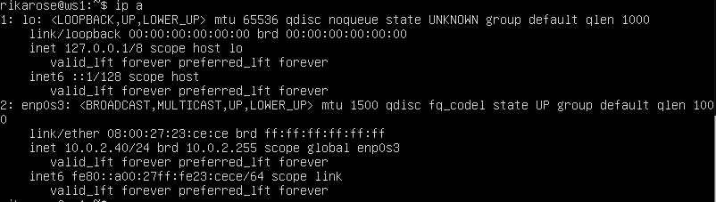

В графическом интерфейсе Oracle VM в настройках каждой машины добавляем Адаптер 2 и выбираем опцию Внутренняя сеть, оставив имя и настройки сети по умолчанию. В выводе команды ip a появился новый интерфейс `enp0s8`. Меняем конфигурационный файл netplan на обеих машинах, описывая новый интерфейс.

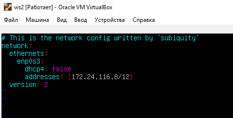

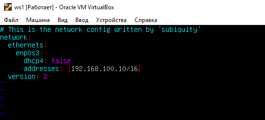

Перезапускаем сервис сети.

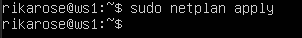

### 2.1. Добавление статического маршрута вручную

Соединяем машины командами `ip r add [адрес] dev [интерфейс]`. Успешно пингуем.

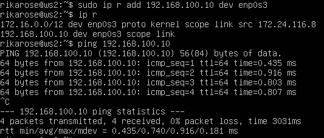

### 2.2. Добавление статического маршрута с сохранением

Указываю статический маршрут в конфигурационных файлах netplan на обеих машинах. Чтобы пункты to: и via: были в одной сети, я добавил каждой машине по статическому айпи в качестве шлюза. Успешно пингуем.

- ws1

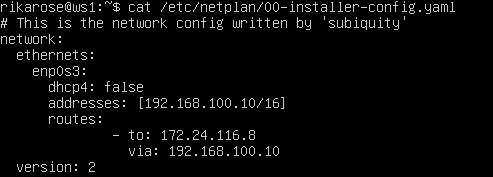

- ws2


- ws1


- ws2

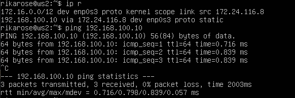

## Part 3. Утилита iperf3

### 3.1. Скорость соединения

```
8 Mbps   = 1 MB/s
100 MB/s = 800000 Kbps
1 Gbps   = 1000 Mbps
```

### 3.2. Утилита iperf3

Чтобы измерить скорость соединения, одной машине присвоим роль сервера командой `iperf3 -s`, а другой роль клиента командой `iperf3 -c [адрес сервера]`. Далее утилита сама проведет тестирование.

Результат - 3.87 Гигабит в секунду.

- ws1

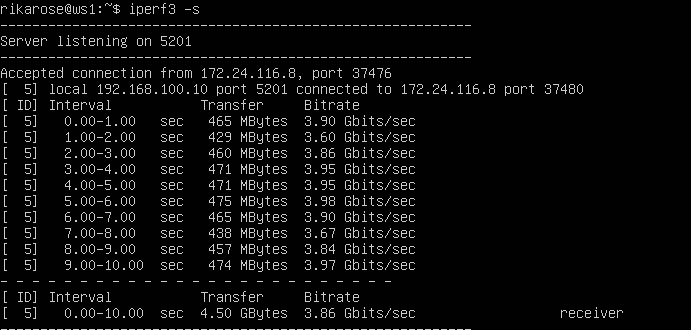

- ws2

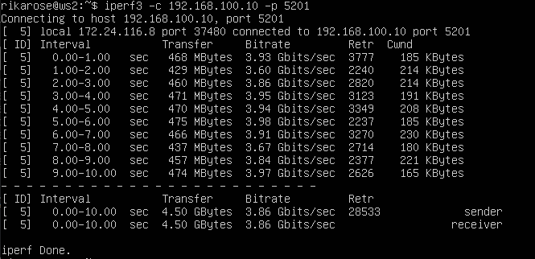

## Part 4. Сетевой экран

### 4.1. Утилита iptables

Содержимое файлов `/etc/firewall.sh`. Входящие пакеты от портов 22 и 80 по протоколу tcp разрешены. На `ws1` подряд прописаны правила запрещающие и разрешающие echo-reply. На `ws2` в разрешающем правиле прописан другой ключ (-I OUTPUT 1 вместо -A OUTPUT), который добавляет правило в начало цепи, вместо конца.

- ws1

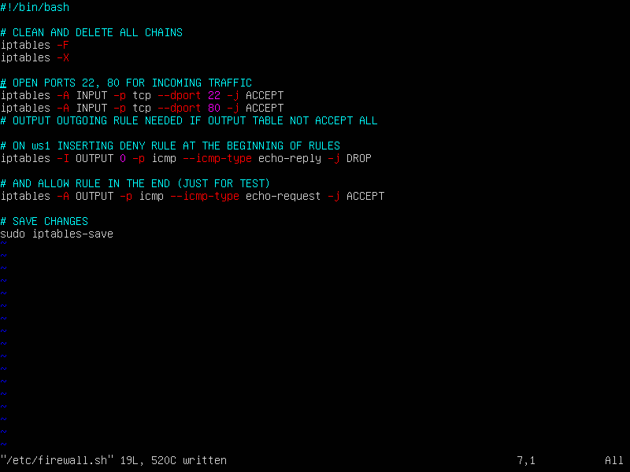

- ws2

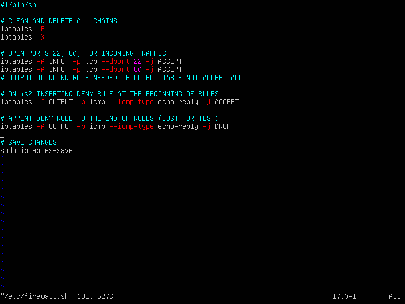

Сравниваем цепочки правил до и после выполнения скрипта. Видим, что на ws1 сначала идет запрещающее правило, а потом разрешающее. На ws2 наоборот.

- ws1 

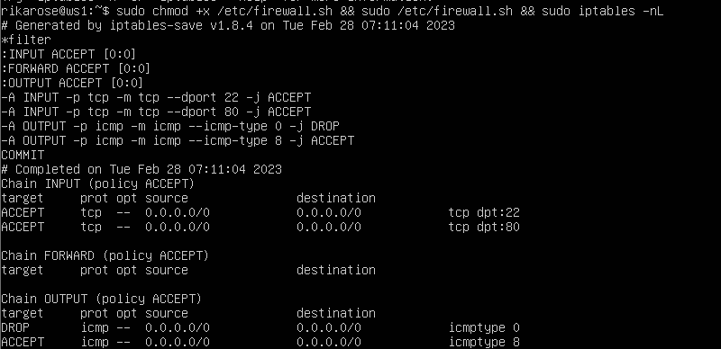

- ws2

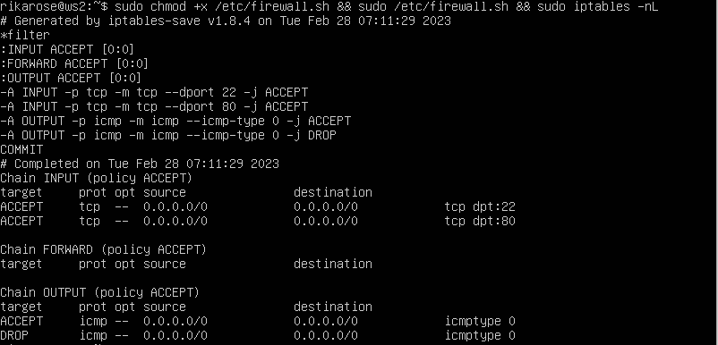

Проверям пинг. ws1 не пингуется, ws2 пингуется.

- ws1

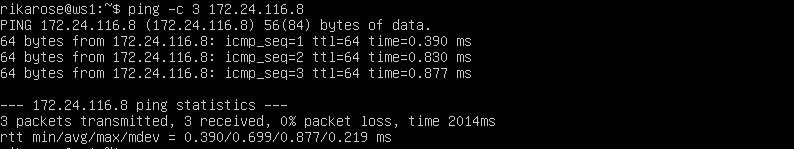

- ws2

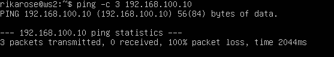

>Разница между инструкциями заключается в следующем: в утилите `iptables` правила выполняются сверху вниз. На первой машине первым указано запрещающее правило на выход, поэтому она не сможет пропинговать другую машину. У второй машины, наоброт - первым указано разрешающее правило, значит она сможет пропинговать другую машину.

### 4.2. Утилита nmap

С помощью утилиты nmap удостоверяемся, что оба хоста запущены.

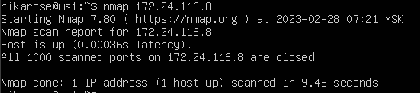
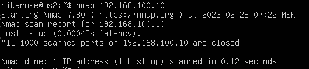

> nmap не видит открытых портов по причине, что в системе не запущены приложения слушающие/ожидающие обращение на ныне открытые порты  

Делаем дамп образов виртуальных машин с помощью инструмена "Сделать снимок состояния/Snapshot" в VirtualBox.

## Part 5. Статическая маршрутизация сети


Для начала я поменяю у всех машин network name scheme в класический вид `ethX`, несматря на то, что текущее именование интерфейсов `enpXsX` надежнее, я сделаю это, что бы максимально соответствовать сети изображенной в иллюстрации выше.

Я воспользуюсь [3-им вариантом](https://www.freedesktop.org/wiki/Software/systemd/PredictableNetworkInterfaceNames/). Для этого нужно:
1. Добавить/изменить строку в файле `/etc/default/grub`
Строка: `GRUB_CMDLINE_LINUX_DEFAULT="net.ifnames=0"`

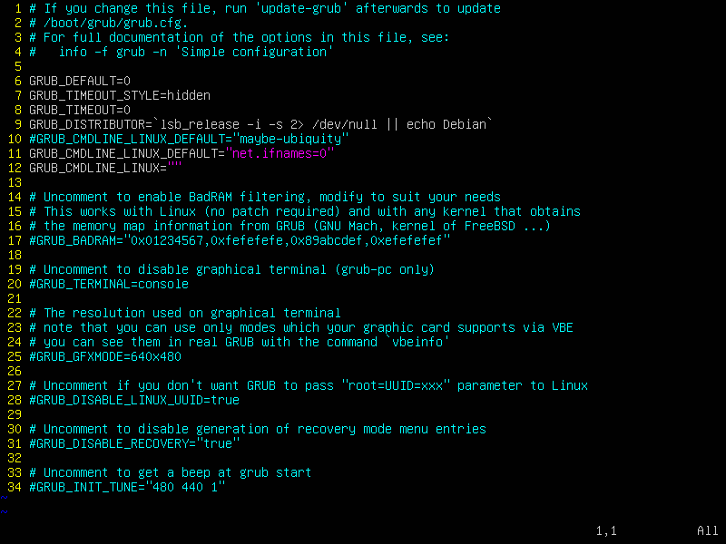

2. Что бы применть изменения в ядре нужно ввести команду: `update-grub`
3. И после перезагрузки имена интерфейсов сети будут иметь традиционный вид `ethX`.

### 5.1. Настройка адресов машин

В VirtualBox клонирую 5 машин и в настройках Virtualbox выставляю всем машинам адаптер 'Внутренняя сеть', также еще по одному адаптеру для роутеров. Далее вношу изменения в конфигурационные файл netplan на всех машинах.

- ws11

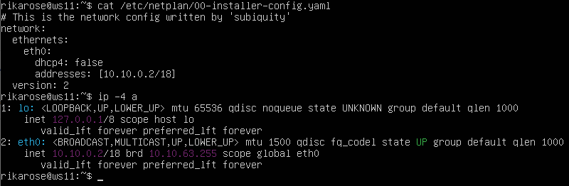

- ws21


- ws22

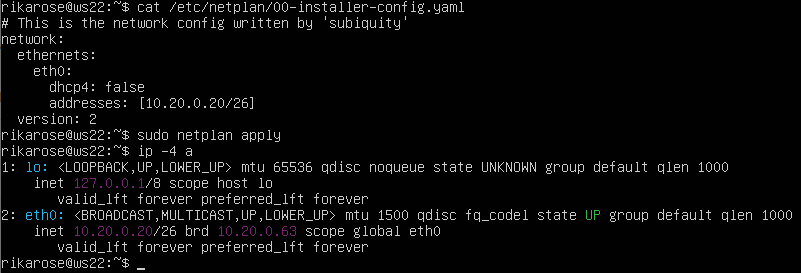

- r1

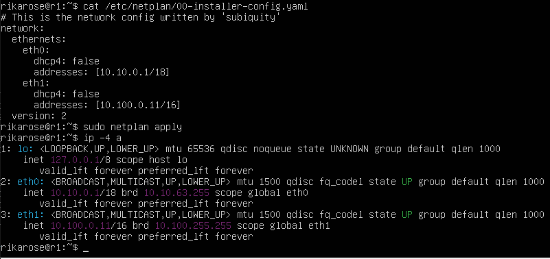

- r2

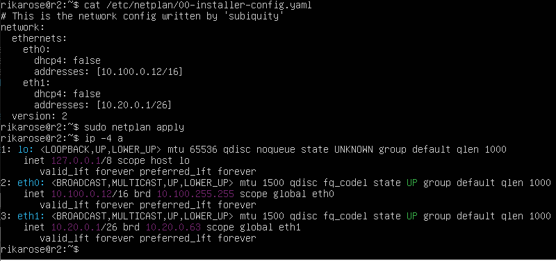

Пингуем ws11 с r1 и наоборот, также ws21, ws22, r2 и наоборот.

- ws11


- ws21

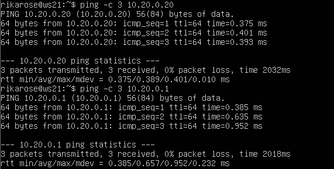

- ws22


### 5.2. Включение переадресации IP-адресов

С помощью команды `sysctl -w net.ipv4.ip_forward=1` включаем переадресацию ip-адресов.

- r1

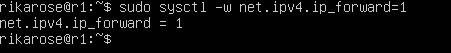

- r2

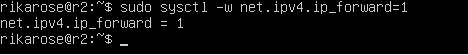

Пробуем другой подход, который сохранится после перезагрузки. В файле `/etc/sysctl.conf` раскомментируем соответствующую строчку и сохраним файл.

- r1

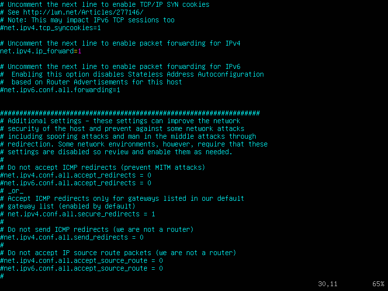

- r2

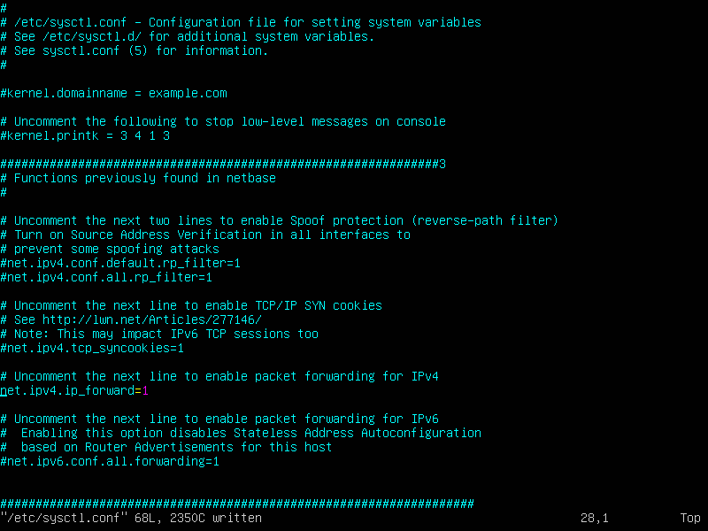

### 5.3. Установка маршрута по умолчанию

Настройка шлюза по умолчаинию:

- ws11

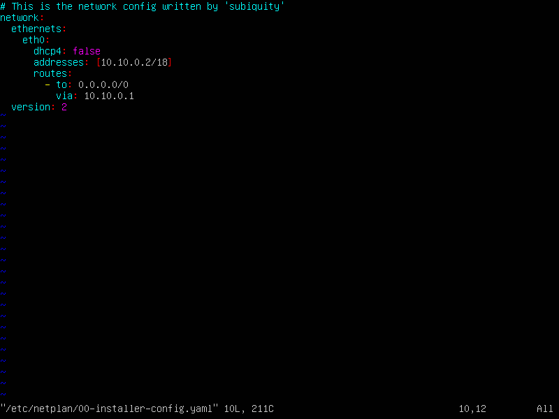

- ws21

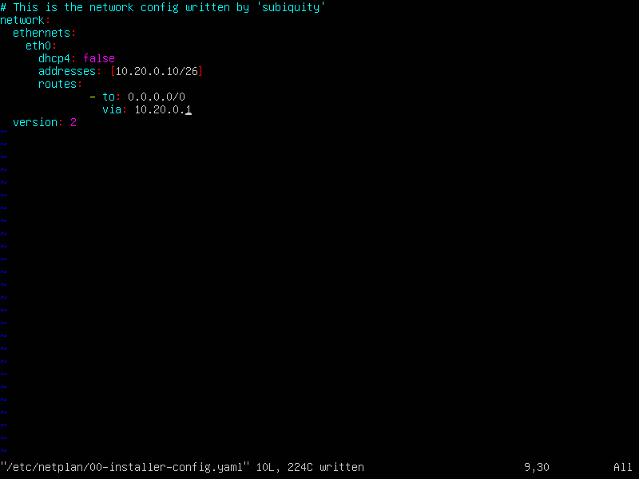

- ws22


Вывод команды `ip r` после настройки `default` шлюза:

- ws11

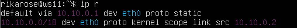

- ws21

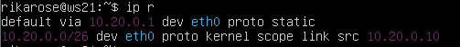

- ws22

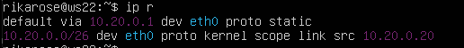


Результат пинга `r2` с `ws11`. Командой `tcpdump -tn -i eth1` слушаем на `r2` отправленные пакеты с `ws11`, перенаправленные через `r1`.

- ws11

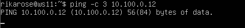

- r2

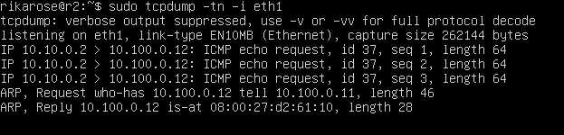

### 5.4. Добавление статических маршрутов

Указал маршруты к локальным сетям:

- r1

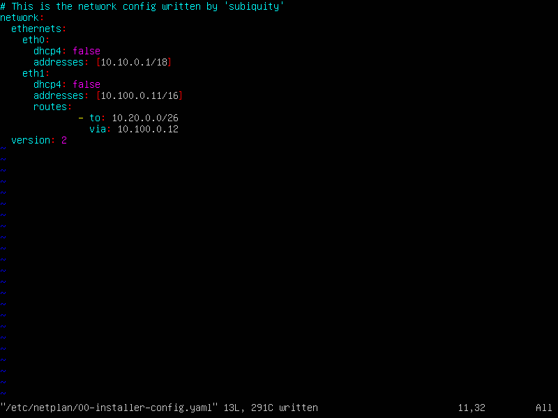

- r2

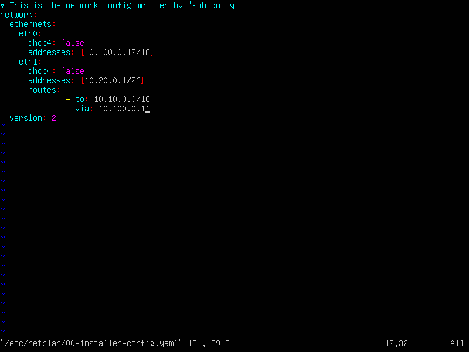

В выводе команды `ip r` видим, что теперь роутеры знают маршруты к каждой из локальных сетей.

- r1

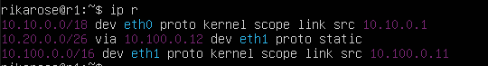

- r2

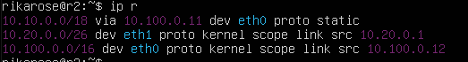

Выводы команды `ip r list 10.10.0.0/[маска сети]` и `ip r list 0.0.0.0/0`:

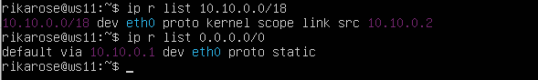

Выводы отличаются, потому что в случае с маршрутом до сети 10.10.0.0/18 машине не нужно обращаться к роутеру, она и так находится в этой сети.

> 0.0.0.0/0 - это немаршрутизируемый адрес IPv4, который можно использовать в разных целях, в основном, в качестве адреса по умолчанию или адреса-заполнителя.

### 5.5. Построение списка маршрутизаторов

Для установки `traceroute` на `ws11` я добавил к машине в Virtualbox адаптер **NAT**, который имеет доступ в интернет.  Учитывая, что на машине уже есть интерфейс со шлюзом по умолчанию, для доступа в интернет, нужно, что бы ядро использовало **NAT** интерфейс, для этого нужно что бы метрика у интерфейса NAT была ниже. В общем и целом, как вариант можно на время установки отключить интерфейс `eth0` командой - `ip link set eth0 down`, но так же можно пойти путем понижения метрики.

> **Router metrics** are configuration values used by a [router](https://en.wikipedia.org/wiki/Router_(computing) "Router (computing)") to make routing decisions. A _metric_ is typically one of many fields in a [routing table](https://en.wikipedia.org/wiki/Routing_table "Routing table"). Router metrics help the router choose the best route among multiple feasible routes to a destination. The route will go in the direction of the gateway with the lowest metric. 
> A router metric is typically based on information such as [path length](https://en.wikipedia.org/wiki/Hop_(networking) "Hop (networking)"), [bandwidth](https://en.wikipedia.org/wiki/Bandwidth_(computing) "Bandwidth (computing)"), [load](https://en.wikipedia.org/wiki/Load_(computing) "Load (computing)"), [hop count](https://en.wikipedia.org/wiki/Hop_count "Hop count"), path cost, [delay](https://en.wikipedia.org/wiki/Network_delay "Network delay"), [maximum transmission unit](https://en.wikipedia.org/wiki/Maximum_transmission_unit "Maximum transmission unit") (MTU), [reliability](https://en.wikipedia.org/wiki/Reliability_(computer_networking) "Reliability (computer networking)") and communications cost.

До настройки:

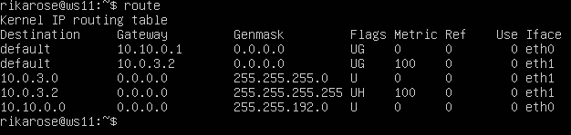

> `eth0` - Внутренняя сеть
> `eth1` - NAT
> При попытке подключения к интернету ядро будет использовать шлюз интерфейса с меньшой метрикой. Для того, что бы метрика у `eth1` стала ниже я прибавлю `eth0` метрики в настройках `netplan` (Для этого можно также воспользоваться утилитой `ifmetric`)

Настройки `netplan` и вывод `route`:

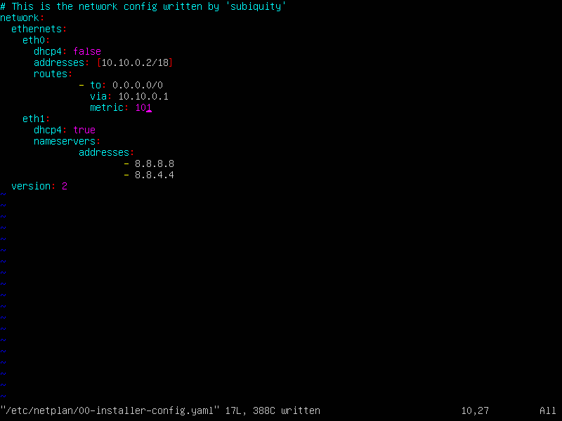

Подтверждение работы интернета:

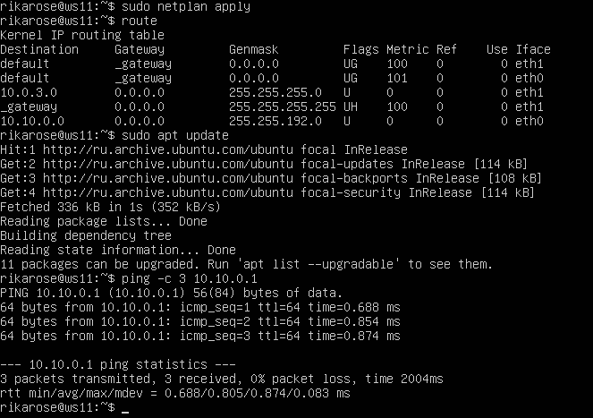

Вызов `traceroute`  (маршрут от `ws11` до `ws21`):

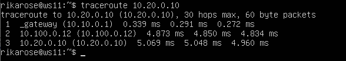

Вывод команды `tcpdump -tnv -i eth0`, относящийся к `traceroute`:

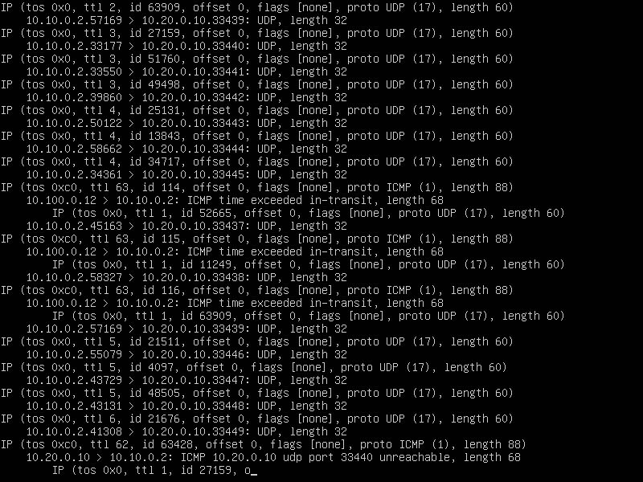

> Принцип работы traceroute:
>
> Утилита отправляет целевому узлу несколько пакетов с временем жизни 1 (TTL, time to live - число переходов, которые пакет может осуществить до своего исчезновения). Следующий маршрутизатор принимает пакеты и отправляет сообщение, что время жизни пакетов истекло. traceroute фиксирует адрес этого маршрутизатора и отправляет следующие пакеты, уже с TTL 2. Так, каждый раз увеличивая TTL на 1, traceroute составляет список маршрутизаторов, через которе прошли пакеты до целевого узла.

### 5.6. Использование протокола ICMP при маршрутизации

Пинг несуществующего айпи с `ws11` и результат перехвата трафика на `r1`:

- ws11

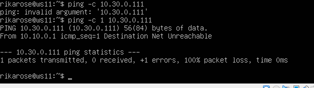

- r1

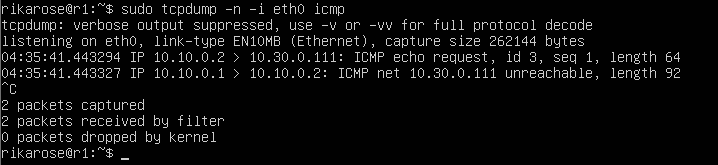

Делаем дамп образов виртуальных машин с помощью инструмена "Сделать снимок состояния/Snapshot" в VirtualBox.

## Part 6. Динамическая настройка IP с помощью DHCP

Перед выполнением нужно установить `isc-dhcp-server`, после установки появятся конфигурационные файлы.

Измененные файлы `/etc/dhcp/dhcpd.conf` и `/etc/resolv.conf`:


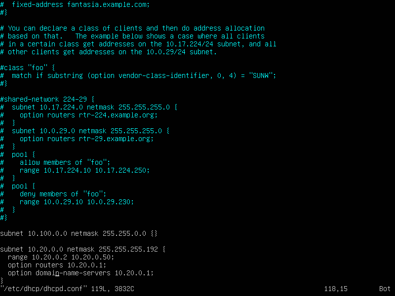

Рестарт и проверка работы службы. Если служба `isc-dhcp-server` не работает, можно посмотреть более подробный вовод ошибки в логах `journalctl -xe`. 

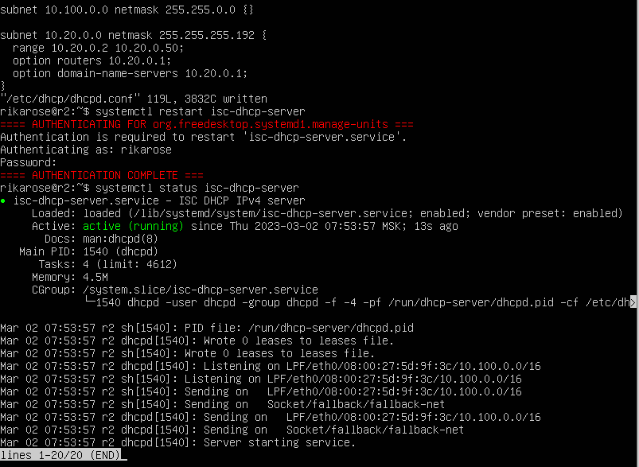

Изменим настройки машин `ws21` и `ws22` в файле конфигурации, чтобы сделать протокол **DHCP** активным. На каждой машине введём.

- ws21

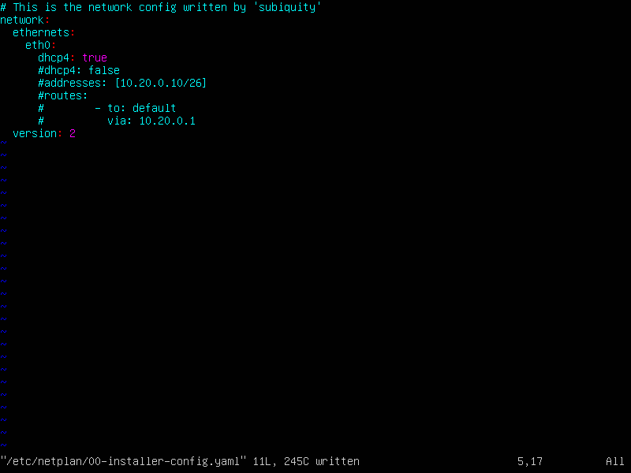

- ws22


- ws21

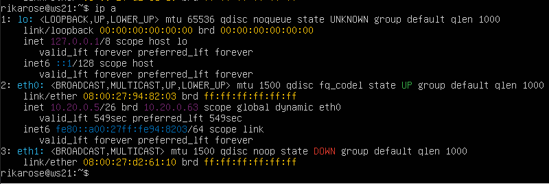

- ws22

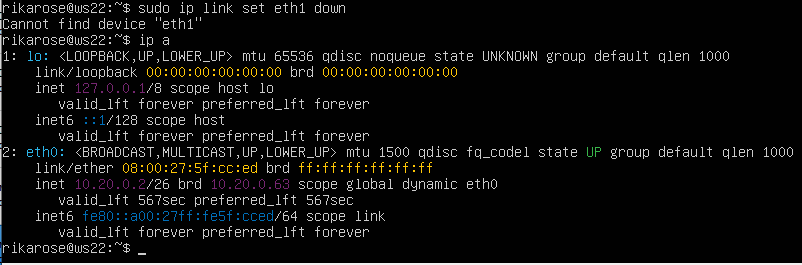

- Пинг ws22 - ws21

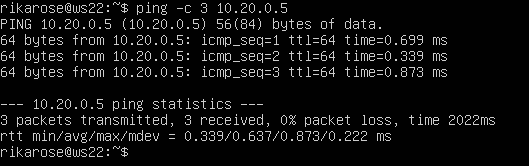

Чтобы указать MAC-адрес у **ws11**, в файл `etc/netplan/00-installer-config.yaml` надо добавить строки: `macaddress: 10:10:10:10:10:BA`, `dhcp4: true`

- ws11

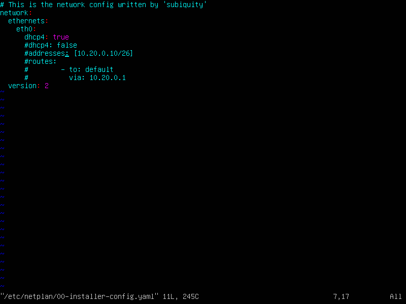

> Так же нужно назначить в Virtualbox такой же mac адрес для интерфейса `ws11`

Для **r1** настроим аналогично **r2**, но выдачу адресов сделаем с жесткой привязкой к MAC-адресу (**ws11**).

- r1

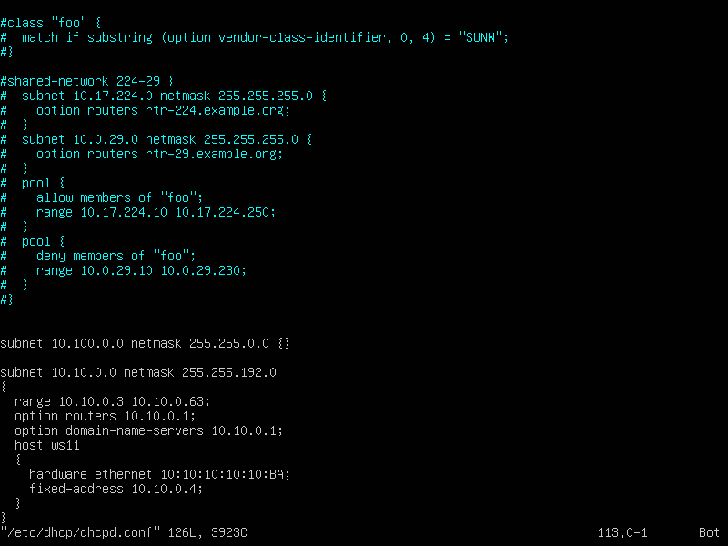


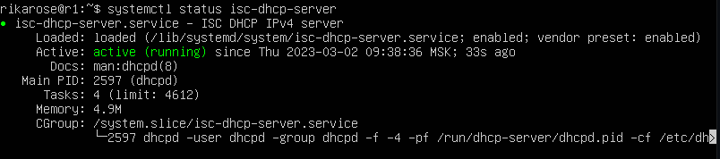

Перезагружаем машины, видим изменения и пингуем `r1` с `w11`.

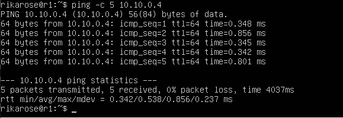

Команда для смены присвоенного ip - `dhclient`, утилита для управления адресом интерфейса по протоколу **DHCP**.

- ip до:

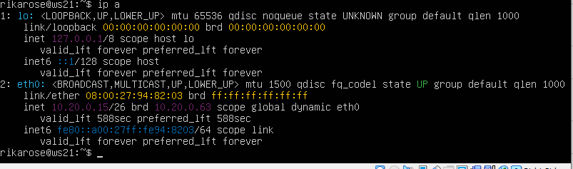

- после:

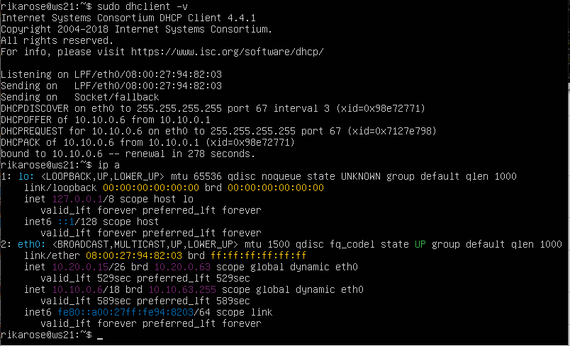

> Для удаления старого ip адреса: `dhclient -r`

Делаем дамп образов виртуальных машин с помощью инструмена "Сделать снимок состояния/Snapshot" в VirtualBox.

## Part 7. NAT

Я установил `apache2` на `r1` и `ws22`, затем отключил для виртуальных машин адаптер NAT.

Измененные `/etc/apache2/ports.conf` и запуск сервиса `apache2`:

- ws22, r1

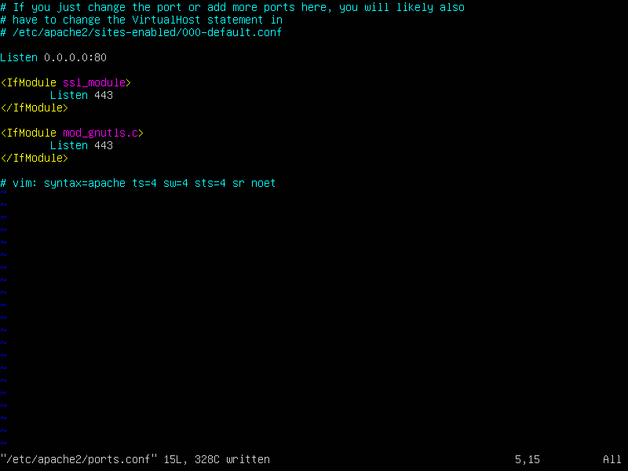

- r1 

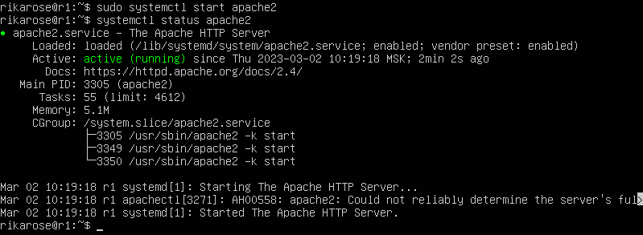

- ws22

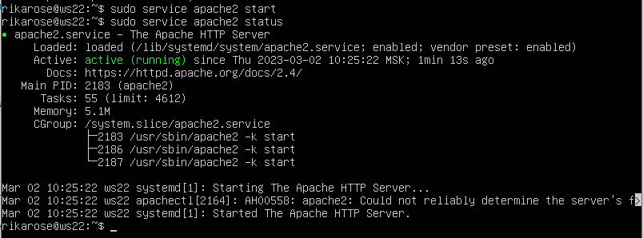

Имзмененные настройи фаервола на `r2` и пинг `ws22`.

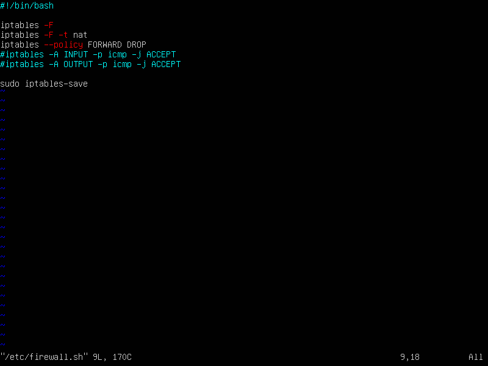

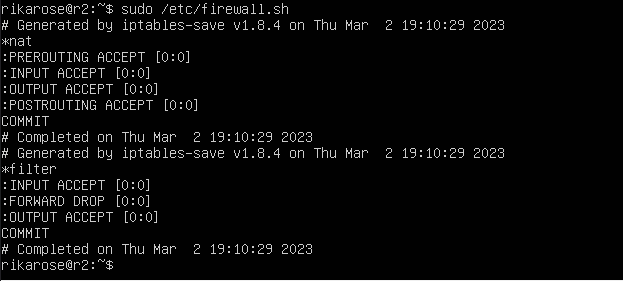

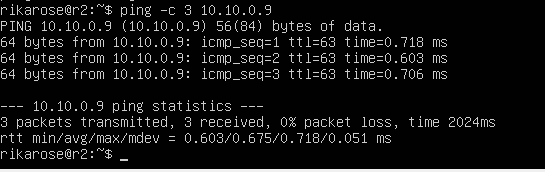

4.  Разрешить маршрутизацию всех пакетов протокола ICMP, для этого прописываем правило для протокола _icmp_ и цепочки _FORWARD_

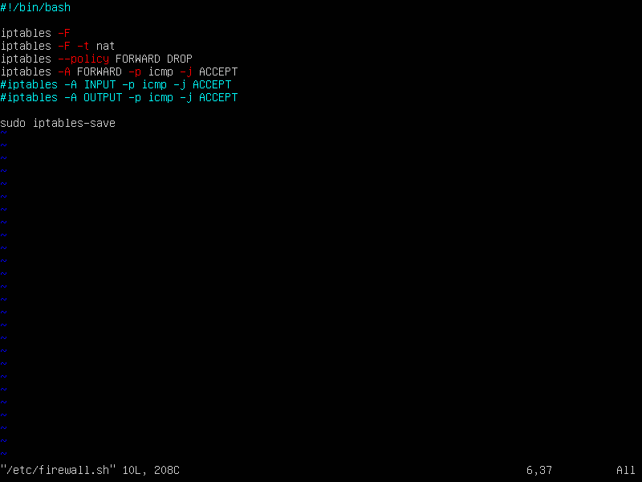

Теперь при запуске файла `firewall.sh` с этими правилами, `ws22` должна "пинговаться" с `r1`.

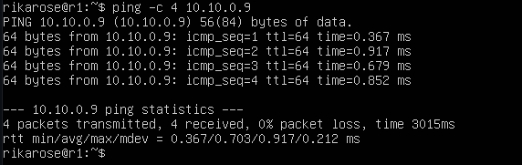

Добавляем в файл ещё два правила:
5.  Включаем **SNAT**, а именно маскирование всех локальных ip из локальной сети, находящейся за `r2` (по обозначениям из Части 5 - сеть `10.20.0.0`)  
6.  Включаем **DNAT** на 8080 порт машины `r2` и добавим к веб-серверу Apache, запущенному на `ws22`, доступ извне сети

- r2 `/etc/firewall.sh`

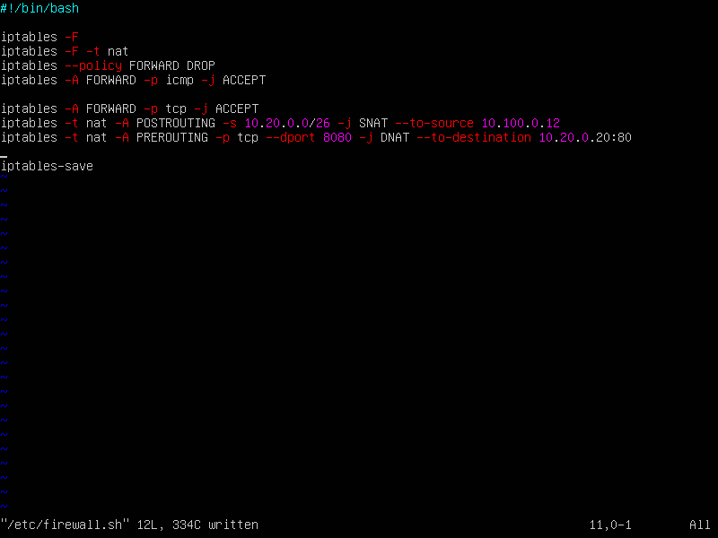

**Значения использованных опций (iptables):**
-   `t` - указывает на используемую таблицу;
-   `p` - указывает протокол, такие как tcp, udp, udplite и другие, поддерживаемые системой, ознакомиться со списком можно в файле `/etc/protocols`;
-   `m` - подключает указанный модуль;
-   `s` - указывает адрес источника пакета, в качестве значения можно указать как один IP-адрес, так и диапазон;
-   `i` - задает входящий сетевой интерфейс;
-   `o` - указывает исходящий сетевой интерфейс;
-   `--dport` - порт получателя пакета;
-   `DNAT` — подменяет адрес получателя в заголовке IP-пакета, основное применение — предоставление доступа к сервисам снаружи, находящимся внутри сети;
-   `SNAT` — служит для преобразования сетевых адресов, применимо, когда за сервером находятся машины, которым необходимо предоставить доступ в Интернет, при этом от провайдера имеется статический IP-адрес.

#### Проверка подключения `telnet` 

- ws22

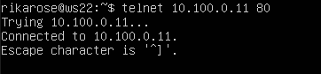

- r1

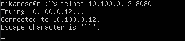

Делаем дамп образов виртуальных машин с помощью инструмена "Сделать снимок состояния/Snapshot" в VirtualBox.