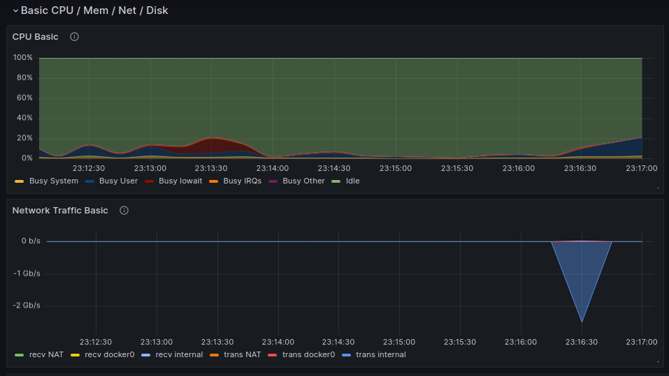

# Prometheus

> Time series databases, just as their name implies, are database systems, specifically developed to handle time-related data.
> Most systems use relational, table-based databases. Time series databases work differently.
> Data is still stored in 'collections', but these collections have one common thing: they aggregate over time.
> Basically, this means that for each point that can be saved, there is a timestamp related to it.
> Prometheus is a time series database to which an entire ecosystem of tools can be attached to extend its functionality. 
> Prometheus is created to monitor a wide variety of systems: servers, databases, virtual machines, basically almost anything.

```sh
# Installation
apt install prometheus
# Start
prometheus --config-file=<path>
# Also start node exporter
prometheus-node-exporter
```

- Prometheus default port: 9090 (http://localhost:9090)

# Grafana

> Grafana is a platform for data visualisation, monitoring and analysis.
> Grafana allows users to create dashboards with panels, each displaying specific indicators over a set period of time.
> Each dashboard is universal, so it can be customised for a certain project.
> Panel is the basic visualisation element of the selected indicators.
> Dashboard is a set of one or more panels placed in a grid with a set of variables (e.g. server name, application name, etc.).

```sh
# Installation
apt install grafana
# Start
grafana server
```

- Grafana default port: 3000 (http://localhost:3000)

___

U can upload template by copy/paste id or copy/paste json


Uploaded template: 


Proof of stress test:

1) Running script `../02/main.sh`


2) Running `stress -c 2 -i 1 -m 1 --vm-bytes 32M -t 10s`


3) Running `iperf3`


